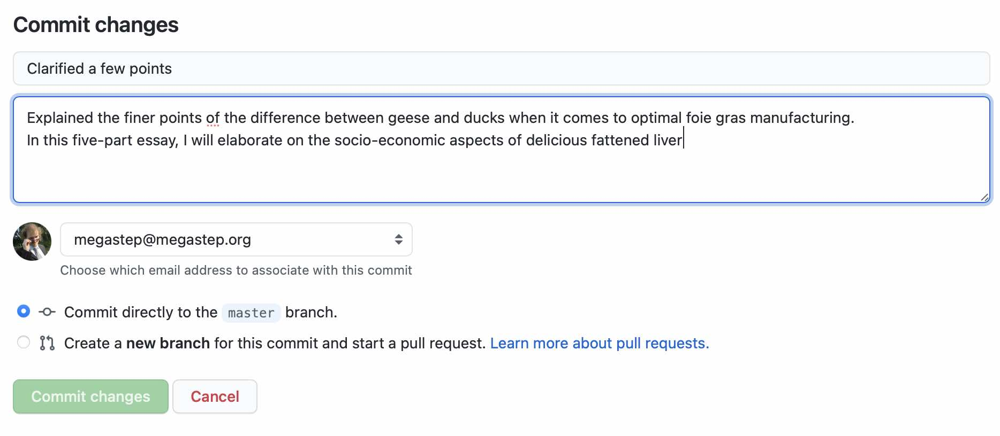

# Updating Your Website

## The Basics

Most content on the website is written in [Markdown](https://en.wikipedia.org/wiki/Markdown), a very simple markup language that is a lot easier to handle than HTML.

You can learn the basics with [this online guide](https://www.markdownguide.org/basic-syntax/), though it should be fairly self-explanatory when editing existing code.

You can do edits through GitHub's built-in Web editor. Click on the link below for the page you want to edit, then click the pen icon to start editing. The majority of the content is in the "_includes" folder.

When you are ready to promote a show, there is a file in the "_data" folder called "show.yml". Change "includeshow" to display the details of the show on your page, and edit the other properties to the correct values.

For most of those files, the first few lines (between `---` lines) are metadata about the page, such as the title and its path on the site. The actual page content starts after that block.

## About editing code on GitHub

When making changes, you can preview what they will look like with the `Preview changes` tab in the editor, though note that you will only see the general styling from the raw text, not the way the styles are rendered on the final site. But this can be a quick check that your Markdown syntax is behaving as expected.

Whenever you edit a file, you need to create a "commit" for your changes. This is done by just filling in details in the form at the bottom of the editor.

Just describe what you did (it will help see the history of changes over time) and submit, and it should become live within a minute or so after GitHub regenerates the site. You can give it a one-liner description as well as an extended description if you want.

## Development Site

Changes pushed to a branch other than `master` get deployed to a development site. This is useful for testing changes before they go live. The URL for the development site is: [https://dev.profundobono-com.pages.dev/](https://dev.profundobono-com.pages.dev/)

Note that while functional this site is not intended for general consumption. In particular it may use test data for payment links.
